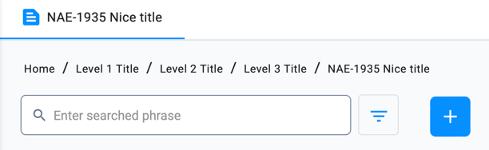
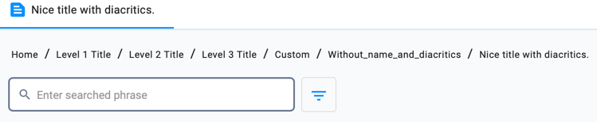

# Breadcrumbs
Breadcrumbs on filtered case views are automatically resolved using URI node path and filter name. However,
if we want a nice breadcrumb with readable title and diacritics, it is important to define each menu item
separately defining uri, identifier and title using Petriflow actions.

The next action, where we define each level separately and define a title for them, will give a nice breadcrumb:
```xml
<caseEvents>
    <event type="create">
        <id>import_menu_on_create</id>
        <actions phase="post">
            <action id="menu_item">
                createOrUpdateMenuItem("/", "level_1", "Level 1 title", "feedback")
                createOrUpdateMenuItem("/level_1", "level_2", "Level 2 title", "feedback")
                createOrUpdateMenuItem("/level_1/level_2", "level_3", "Level 3 title", "feedback")
                def body1 = new com.netgrif.application.engine.workflow.domain.menu.MenuItemBody("/level_1/level_2/level_3", "nae_1935_1", "NAE-1935 Nice title", "text_snippet")
                createOrUpdateMenuItemAndFilter(body1, "processIdentifier:nae_1935", "Case", "private", ["nae_1935"])
            </action>
        </actions>
    </event>
</caseEvents>
```
Result:



However, if we define a multilevel menu in one action:
```xml
<caseEvents>
    <event type="create">
        <id>import_menu_on_create</id>
        <actions phase="post">
            <action id="menu_item">
                def body5 = new com.netgrif.application.engine.workflow.domain.menu.MenuItemBody("/level_1/level_2/level_3/custom/without_name_and_diacritics", "with_diacritics", "Nice title with diacritics.", "text_snippet")
                createOrUpdateMenuItemAndFilter(body5, "processIdentifier:nae_1935", "Case", "private", ["nae_1935"])
            </action>
        </actions>
    </event>
</caseEvents>
```
The menu without a defined title will be sanitized and look like as folows:

